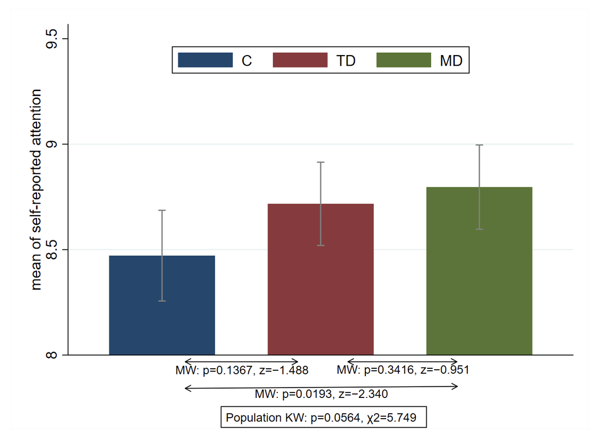
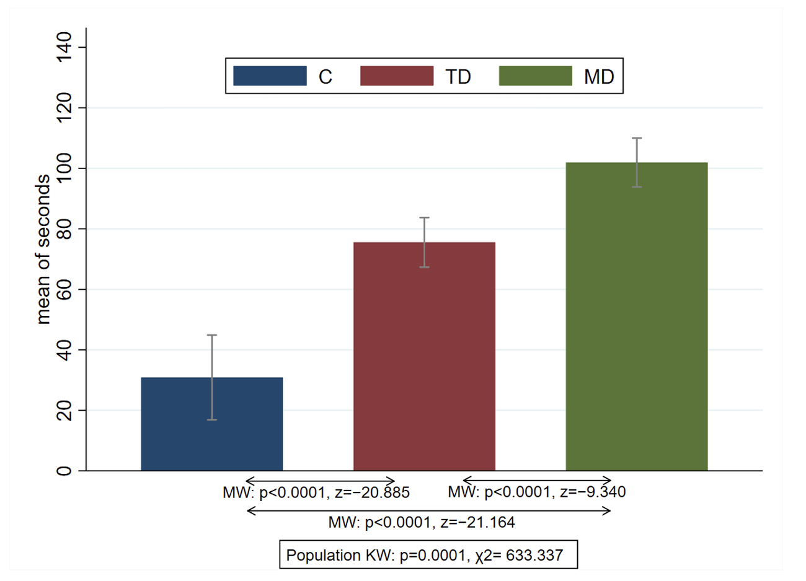
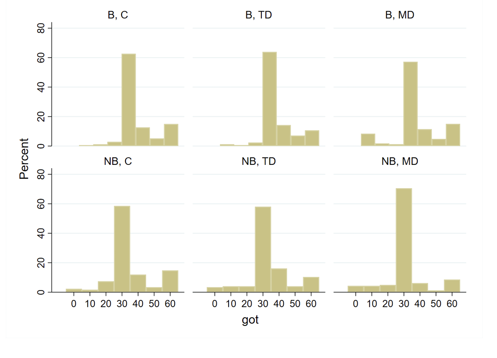
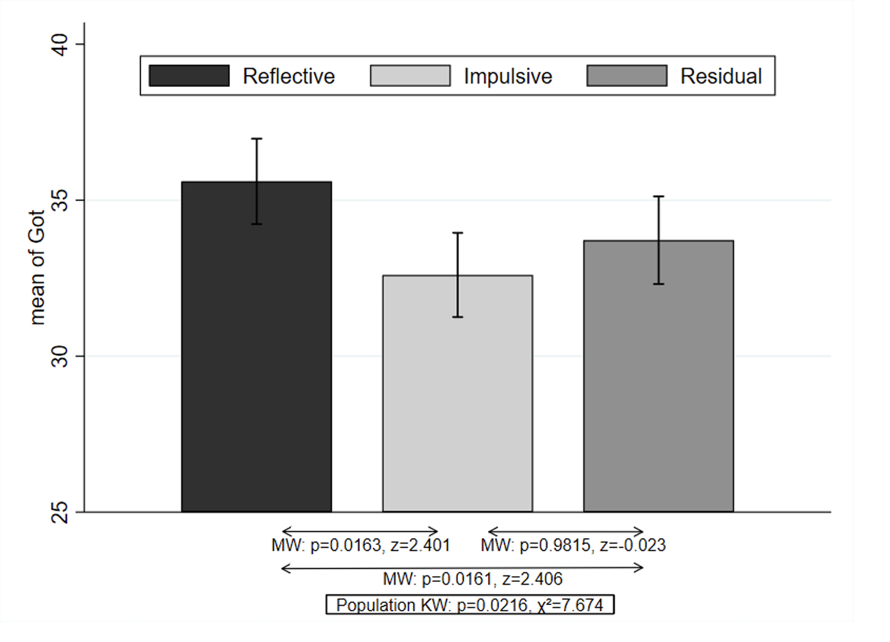

# Loading Libraries

```{r Settings & Loading Packages, echo = FALSE, warning = FALSE, message=FALSE}
# Settings
knitr::opts_chunk$set(echo = FALSE, warning = FALSE)
# Libraries
library(dplyr)
library(readr)
library(ggplot2)
library(tidyr)
library(readxl)
library(knitr)
library(zoo)
library(lmtest)
library(AER)
library(gridExtra)
library(kableExtra)
library(pscl)
```

# Loading Data

```{r Loading Data}
link_to_data <- "https://osf.io/download/uh4z7/?view_only=de730bd958ef4711819216d30361c8d8"
file_to_save <- "data_DMDDG.xls"

if (!file.exists(file_to_save)) download.file(url = link_to_data, destfile = file_to_save)
df <- read_xls(file_to_save)

head(df)
```

# Introduction

# Data preparation


```{r Functions}
#' Perform Mann-Whitney U test
#'
#' @param df data.frame
#' @param group_column_name name of column with groups
#' @param group_1_name name of first group
#' @param group_2_name name of second group
#' @param value_name name of column with values to compare
#'
#' @return
#' @export
#'
#' @examples
#' do_mann_whitney(mtcars, "cyl", "4", "6", "mpg")
do_mann_whitney <- function(df, group_column_name, group_1_name, group_2_name, value_name) {
    y1 <- df[df[[group_column_name]] == group_1_name, ][[value_name]]
    y2 <- df[df[[group_column_name]] == group_2_name, ][[value_name]]
    wilcox.test(y1, y2)
}

#' Star p-values
#'
#' @param x numeric vector with pvalues
#'
#' @return
#' @export
#'
#' @examples
#' star_p_value(c(1, .4, 1e-6, .04, .07))
star_p_value <- function(x) {
    res <- rep("", length(x))
    res[x < .1] <- "*"
    res[x < .05] <- "**"
    res[x < .01] <- "***"
    res
}

#' Prettify data.frame with coefficients
#'
#' @param x data.frame with coefficients
#'
#' @return
#' @export
#'
#' @examples
#' pretty_t(summary(lm(hp ~ ., mtcars))$coefficients, pvalue_name = "Pr(>|t|)")
pretty_t <- function(x, pvalue_name = "Pr(>|z|)") {
    zero_model <- as.data.frame(x)
    # Getting variable names
    zero_model$vars <- row.names(zero_model)
    # Removing intercept
    zero_model <- zero_model[zero_model$vars != "(Intercept)", ]
    # Copying column with pvalue
    zero_model$pvalue <- zero_model[[pvalue_name]]
    # Creating print-friendly column
    zero_model <- zero_model %>% 
        mutate(rounded_est = round(Estimate, 3),
               rounded_std = round(`Std. Error`, 3),
               rounded_pvl = round(pvalue, 3),
               to_print = paste0(rounded_est, star_p_value(pvalue), "<br>(", rounded_std, ")[", rounded_pvl, "]"))
    # Removing redundant columns and row.names 
    zero_model <- zero_model[c("vars", "to_print")]
    row.names(zero_model) <- NULL
    zero_model
}

#' Prettify coefficients for 'coeftest' class
#'
#' @param x model that summarry returns 'coeftest' as its coefficients
#'
#' @return
#' @export
#'
#' @examples
pretty_t_coefftest <- function(x) {
    rbind(pretty_t(x = unclass(summary(x)$coefficients)) %>% filter(vars != "Log(scale)"), 
          data.frame(vars = "log likelihood", to_print = round(min(summary(x)$loglik), 0)))
}

#' Merge list of data.frames
#'
#' @param df_list_to_merge list of data frames to merge
#' @param merge_by name of column to merge by
#'
#' @return
#' @export
#'
#' @examples
#' to_frame_multi(list(data.frame(var1 = c("A", "V"), var2 = 3:4), data.frame(var1 = c("V", "W"), var2 = 1:2)), "var1")
to_frame_multi <- function(df_list_to_merge, merge_by = "vars") {
    Reduce(function(x, y) merge(x, y, by = merge_by, all = T, sort = F), x = df_list_to_merge)
}

# Define a function to fit Tobit models
#' Title
#'
#' @param data data.frame
#' @param predictors vector of names of predictors
#' @param interaction logical - include interactions?
#'
#' @return
#' @export
#'
#' @examples
fit_tobit <- function(data, predictors, to_predict = "Got", interaction = FALSE, limits = list(left = .1, right = .6)) {
    model_formula <- sprintf("%s ~ %s", to_predict, paste(predictors, collapse = " + "))
    if (interaction) {
        model_formula <- sprintf("%s+%s", model_formula, paste(paste("MD *", predictors[3:length(predictors)]), collapse = " + "))
    }
    model <- tobit(as.formula(model_formula), data = df, left = limits$left, right = limits$right)
    return(model)
}

reorder_rename <- function(tbl_, named_vector) {
    tbl_ %>% 
        slice(match(names(named_vector), vars)) %>% 
        mutate(vars = unname(named_vector[names(named_vector) %in% tbl_$vars]))    
}
```

```{r Variables}
vars_final <- c("BDGBDG" = "BDG", "attention" = "ATTENTION", 
                "treatment_group_factorTD" = "TD", "treatment_group_factorMD" = "MD", 
                "ee" = "EE", "nb" = "NB", "ne" = "NE", 
                "crt_right" = "CRT right/int", "female" = "Female", "household_income" = "Household income", 
                "log likelihood" = "log likelihood")
```


# Reproducing results - main article

## Table 1. Number of participants for each of the 3 × 2 experimental conditions (Research Paper)

<div class = "row">
  
<div class = "col-md-6">

*Original*

|                            | Control       | Time Delay     | Motivated Delay |
|--------------------|-----------------|-----------------|-----------------|
| **Standard Dictator Game** | DG-C (N=174)  | DG-TD (N=169)  | DG-MD (N=166)   |
| **Bully Dictator Game**    | BDG-C (N=176) | BDG-TD (N=174) | BDG-MD (N=163)  |

</div>

<div class = "col-md-6">
*Reproduced*
```{r mapping variables, echo=FALSE}
# Map the treatments to 'C', 'TD', and 'MD'
df$treatment_group <- ifelse(grepl("^control", df$treatment), "C",
                              ifelse(grepl("^delay", df$treatment), "TD", "MD"))

df$game_type <- ifelse(df$bully == 0, "Standard Dictator Game", "Bully Dictator Game")

df$game_type_short <- ifelse(df$bully == 0, "SDG", "BDG")
df$game_type_short <- factor(df$game_type_short, levels = c("SDG", "BDG"))
df$bully_type <- ifelse(df$bully == 0, "NB", "B")
df$give <- 60 - df$kept

# Count occurrences of each combination of game_type and treatment_group
count_df <- df %>% 
  group_by(game_type, treatment_group) %>% 
  summarise(count = n(), .groups = 'drop') %>%
  mutate(game_type = factor(game_type, levels = c("Standard Dictator Game", "Bully Dictator Game")),
         treatment_group = dplyr::recode(treatment_group,
                                  "C" = "Control",
                                  "TD" = "Time Delay",
                                  "MD" = "Motivated Delay")) %>%
  pivot_wider(names_from = treatment_group, values_from = count, values_fill = list(count = 0)) %>%
  arrange(game_type)

# Print the counts with a title
kable(count_df) %>% kable_styling()
```

</div></div>

Table 1 results match between the research paper and reproducible code 

## Table 2. Differences across treatments of socio-demographic characteristics(Research Paper)

<div class = "row">
  
<div class = "col-md-6">

*Original*

| Variable         | Test           | p (by treatment) | p (by cogn. manip.) |
|------------------|----------------|------------------|---------------------|
| CRT right        | Kruskal–Wallis | 0.272            | 0.378               |
| CRT int          | Kruskal–Wallis | 0.221            | 0.280               |
| Female           | $\chi^2$.      | 0.527            | 0.488               |
| Age              | Kruskal–Wallis | 0.510            | 0.545               |
| Household income | Kruskal–Wallis | 0.286            | 0.404               |
| Children         | $\chi^2$       | 0.821            | 0.669               |
| Full time job    | $\chi^2$       | 0.171            | 0.688               |
| Christian        | $\chi^2$       | 0.339            | 0.518               |
| Student          | $\chi^2$       | 0.994            | 0.913               |
| Democrat         | $\chi^2$       | 0.549            | 0.398               |

</div>
<div class = "col-md-6">

*Reproduced*
```{r Table 2, echo=FALSE}
# Standard Dictator Game Data
DG <- subset(df, treatment %in% c("controlNObully", "delayNObully", "motivationNObully"))

# Bully Dictator Game Data
BDG <- subset(df, !(treatment %in% c("controlNObully", "delayNObully", "motivationNObully")))

# Data Preparation & Analysis
################ Sample balance (TABLE 2) ######################

variables <- c("crt_right", "crt_int", "female", "age", "household_income",
               "children", "FT_job", "christian", "student", "democrat")

# Define the type of test for each variable
test_types <- c("Kruskal-Wallis", "Kruskal-Wallis", "Chi-squared", "Kruskal-Wallis", "Kruskal-Wallis",
                "Chi-squared", "Chi-squared", "Chi-squared", "Chi-squared", "Chi-squared")

#By MOC
p_values_moc <- c(
  kruskal.test(df$crt_right ~ df$moc)$p.value,
  kruskal.test(df$crt_int ~ df$moc)$p.value,
  chisq.test(table(df$moc, df$female))$p.value,
  kruskal.test(df$age ~ df$moc)$p.value,
  kruskal.test(df$household_income ~ df$moc)$p.value,
  chisq.test(table(df$moc, df$children))$p.value,
  chisq.test(table(df$moc, df$FT_job))$p.value,
  chisq.test(table(df$moc, df$christian))$p.value,
  chisq.test(table(df$moc, df$student))$p.value,
  chisq.test(table(df$moc, df$democrat))$p.value
)

#BY Treatment
p_values_treatment <- c(
  kruskal.test(df$crt_right ~ df$treatment)$p.value,
  kruskal.test(df$crt_int ~ df$treatment)$p.value,
  chisq.test(table(df$treatment, df$female))$p.value,
  kruskal.test(df$age ~ df$treatment)$p.value,
  kruskal.test(df$household_income ~ df$treatment)$p.value,
  chisq.test(table(df$treatment, df$children))$p.value,
  chisq.test(table(df$treatment, df$FT_job))$p.value,
  chisq.test(table(df$treatment, df$christian))$p.value,
  chisq.test(table(df$treatment, df$student))$p.value,
  chisq.test(table(df$treatment, df$democrat))$p.value
)

# Combine into a dataframe
results_table <- data.frame(
  Variables = variables,
  Test_Type = test_types,
  Treatment_P_Value = round(p_values_treatment, 3),
  Moc_P_Value = round(p_values_moc, 3)
)

# Print the counts with a title
kable(results_table) %>% kable_styling()
```
</div></div>

Table 2 results match between the research paper and reproducible code

## Figure 2

<div class = "row">
  
<div class = "col-md-6">

*Original*


Authors comments:

> Fig. 2. In the Standard Dictator Game, the amount got by the dictators does not differ significantly under the different cognitive manipulations and the control treatment. There is no statistically significant difference among the average of money got by the dictators in the Control (M = 36.09, SD = 12.01), the Time Delay (M = 35.32, SD = 11.23), and the Motivated Delay (M = 33.61, SD = 15.45) treatments (Kruskal–Wallis, p = 0.5204).

</div>

<div class = "col-md-6">
*Reproduced*
```{r Figure 2 Plot, echo=FALSE}
# Filter the dataset for the Standard Dictator Game
standard_dictator_game_data <- df %>%
  filter(game_type == "Standard Dictator Game") %>%
  group_by(treatment_group) %>%
  summarise(
    Mean = mean(kept, na.rm = TRUE),
    SD = round(sd(kept, na.rm = TRUE),2),
    SE = sd(kept, na.rm = TRUE) / sqrt(n()) # Standard error
  ) %>%
  ungroup() %>%
  arrange(desc(Mean)) %>%
  mutate(treatment_group = factor(treatment_group, levels = unique(treatment_group)))

# Plot the bar graph with sorted bars
ggplot(standard_dictator_game_data, aes(x = treatment_group, y = Mean, fill = treatment_group)) +
  geom_bar(stat = "identity", width = 0.5, alpha = 0.5) +
  geom_errorbar(aes(ymin = Mean - SE, ymax = Mean + SE), width = 0.2, color = "black") +
  scale_fill_manual(values = c("C" = "red", "TD" = "green", "MD" = "blue")) +
  labs(title = "Figure 2: Standard Dictator Game", y = "Mean of Got", x = NULL) +
  theme_minimal() +
  theme(plot.title = element_text(hjust = 0.5), legend.position = "none")

```

```{r Figure 2 Mean_SD, echo=FALSE}
# Mean and SD for the distributions of 'kept' across different treatment groups within the Standard Dictator Game.
kable(standard_dictator_game_data) %>% kable_styling()
```

```{r Figure 2 KW, echo=FALSE}
# Performing Kruskal-Wallis test to compare the distributions of 'kept' across different treatment groups within the Standard Dictator Game.

# Conduct Kruskal-Wallis test
kruskal_test <- kruskal.test(kept ~ treatment_group, data = df %>% filter(game_type == "Standard Dictator Game"))

# Store the p-value for use in the plot annotation
p_value <- round(kruskal_test$p.value, 4)

paste("Kruskal-Wallis for standard dictator game, p =", p_value)
```

</div></div>
Figure 2 and its results match between the research paper and reproducible code

## Figure 3

<div class = "row">
  
<div class = "col-md-6">

*Original*


Authors comments:

> Fig. 3. In the Bully Dictator Game, the dictators get the lowest amount under motivated delay. The average amount of money the dictators got in the Motivated delay treatment (M = 30.80, SD = 12.22) is lower than in the Time Delay treatment (M = 33.28, SD = 12.91), and lower than the amount of money got by the dictators in the Control treatment (M = 34.54, SD = 13.17). Statistically significant differences are observed among the TD, MD, and C treatments (Kruskal–Wallis, p = 0.0145). Pairwise comparisons reveal that the MD treatment has a significantly lower average Got level compared to both TD (Mann–Whitney test, $z = 2.467$, $p = 0.0136$) and C treatments (Mann–Whitney test, $z = 2.659$, $p = 0.0078$), while no significant difference is found between the TD and C treatments (Mann–Whitney test, $z = 0.289$, $p = 0.7723$). Note. Confidence intervals on means are at 95%.

</div>
<div class = "col-md-6">
*Reproduced*
```{r Figure 3 Plot, echo=FALSE}
# Filter the dataset for the Bully Dictator Game
bully_dictator_game_data <- df %>%
  filter(game_type == "Bully Dictator Game") %>%
  group_by(treatment_group) %>%
  summarise(
    Mean = mean(kept, na.rm = TRUE),
    SD = round(sd(kept, na.rm = TRUE),2),
    SE = sd(kept, na.rm = TRUE) / sqrt(n()) # Standard error
  ) %>%
  ungroup() %>%
  arrange(desc(Mean)) %>%
  mutate(treatment_group = factor(treatment_group, levels = unique(treatment_group)))

# Plot the bar graph with sorted bars
ggplot(standard_dictator_game_data, aes(x = treatment_group, y = Mean, fill = treatment_group)) +
  geom_bar(stat = "identity", width = 0.5, alpha = 0.5) +
  geom_errorbar(aes(ymin = Mean - SE, ymax = Mean + SE), width = 0.2, color = "black") +
  scale_fill_manual(values = c("C" = "red", "TD" = "green", "MD" = "blue")) +
  labs(title = "Figure 2: Bully Dictator Game", y = "Mean of Got", x = NULL) +
  theme_minimal() +
  theme(plot.title = element_text(hjust = 0.5), legend.position = "none")

```

```{r Figure 3 Mean_SD, echo=FALSE}
kable(bully_dictator_game_data) %>% kable_styling()
```

```{r Figure 3 KW, echo=FALSE}
# Perform Kruskal–Wallis test for BDG
# Testing for differences in the 'kept' variable distributions across different levels of 'moc' within the Bully Dictator Game
kruskal_BDG <- kruskal.test(kept ~ moc, data = BDG)
print("Kruskal-Wallis test for Bully Dictator Game:")
print(kruskal_BDG)

# Perform Mann-Whitney U test for BDG choice
group_C <- BDG[BDG$treatment_group == "C", "kept"]$kept
group_TD <- BDG[BDG$treatment_group == "TD", "kept"]$kept
group_MD <- BDG[BDG$treatment_group == "MD", "kept"]$kept

# Perform Mann-Whitney U test between TD and MD for BDG
# This test compares the distribution of 'kept' between TD and MD within the Bully Dictator Game
result_TD_MD <- wilcox.test(group_TD, group_MD)
z_value_TD_MD <- qnorm(1 - result_TD_MD$p.value / 2)  # Convert p-value to z-score
p_value_TD_MD <- result_TD_MD$p.value
cat(sprintf("Mann-Whitney U test for BDG between TD and MD, z = %.3f, p = %.4f.\n", z_value_TD_MD, p_value_TD_MD))

# Perform Mann-Whitney U test between C and MD for BDG
# This test compares the distribution of 'kept' between C and MD within the Bully Dictator Game
result_C_MD <- wilcox.test(group_C, group_MD)
z_value_C_MD <- qnorm(1 - result_C_MD$p.value / 2)
p_value_C_MD <- result_C_MD$p.value
cat(sprintf("Mann-Whitney U test for BDG between C and MD, z = %.3f, p = %.4f.\n", z_value_C_MD, p_value_C_MD))

# Perform Mann-Whitney U test between C and TD for BDG
# This test compares the distribution of 'kept' between C and TD within the Bully Dictator Game
result_C_TD <- wilcox.test(group_TD, group_C)
z_value_C_TD <- qnorm(1 - result_C_TD$p.value / 2)
p_value_C_TD <- result_C_TD$p.value
sprintf("Mann-Whitney U test for BDG between C and TD, z = %.3f, p = %.4f.\n", z_value_C_TD, p_value_C_TD)
```

</div></div>

Figure 3 and its results match between the research paper and reproducible code

## Figure 4

<div class = "row">
  
<div class = "col-md-6">

*Original*


Authors comments:

> Fig. 4. The amount got by the dictator in the Bully Dictator game is consistently lower than that in the standard Dictator game, but only under Motivated Delay the difference is statistically significant. The average amount the dictator got under Motivated Delay is lower in the Bully variant of the dictator game (M = 30.80, SD = 12.22) than in the standard one (M = 33.61, SD = 15.46). The average amount the dictator got under Time Delay is lower in the Bully variant of the Dictator game (M = 33.28, SD = 12.9) than in the standard one (M = 35.33, SD = 11.24). The average amount the dictator got in the Control treatment is lower in the Bully variant of the dictator game (M = 34.54, SD = 13.17) than in the standard one (M = 36.09, SD = 12.01). However, the difference between the two variants of the dictator game is statistically significant only in the case of Motivated Delay (Mann–Whitney test, $z= 2.595$, $p = 0.0095$).

</div>
<div class = "col-md-6">
*Reproduced*

## Figure 4 Reproducible Results

```{r Figure 4 Plot, echo=FALSE}
# Filter the dataset for the Bully Dictator Game
dictator_game_data <- df %>%
  mutate(game_type = case_when(
    game_type == "Standard Dictator Game" ~ "DG",
    game_type == "Bully Dictator Game" ~ "BDG"
  )) %>%
  group_by(game_type, treatment_group) %>%
  summarise(
    Mean = round(mean(kept, na.rm = TRUE), 2),
    SD = round(sd(kept, na.rm = TRUE), 2),
    SE = round(sd(kept, na.rm = TRUE) / sqrt(n()), 2), # Standard error
    .groups = "drop" # Drop grouping after summarisation
  ) %>%
  mutate(game_type = factor(game_type, levels = c("DG", "BDG"))) %>%
  arrange(game_type, desc(Mean))

# Plot the data
ggplot(dictator_game_data, aes(x = treatment_group, y = Mean, fill = game_type)) +
  geom_bar(stat = "identity", position = position_dodge(), width = 0.7, alpha=0.9) +
  geom_errorbar(aes(ymin = Mean - SE, ymax = Mean + SE),
                position = position_dodge(0.7), width = 0.25) +
  scale_fill_manual(values = c("DG" = "yellow", "BDG" = "grey")) +
  labs(title = "Figure 4: Mean of Got by Treatment Group and Game Type",
       y = "Mean of Got") +
  theme_minimal() +
  theme(plot.title = element_text(hjust = 0.5))

```

```{r Figure 4 Mean_SD, echo=FALSE}
kable(dictator_game_data) %>% kable_styling()
```

```{r Figure 4 MW, echo=FALSE}
# Filter data for Motivated Delay in both game types
motivated_delay_data <- df %>%
  filter(treatment_group == "MD" & game_type %in% c("Standard Dictator Game", "Bully Dictator Game")) %>%
  mutate(game_type = ifelse(game_type == "Standard Dictator Game", "DG", "BDG"))

# Split the data by game type
dg_data <- motivated_delay_data %>% filter(game_type == "DG") %>% pull(kept)
bdg_data <- motivated_delay_data %>% filter(game_type == "BDG") %>% pull(kept)

# Conduct Mann-Whitney test on the filtered data
test_result <- wilcox.test(dg_data, bdg_data)

# Extracting the test statistic and p-value
z_value <- qnorm(1 - test_result$p.value / 2)  # Convert p-value to z-score
p_value <- test_result$p.value

sprintf("Mann–Whitney test applied between DG (Standard Dictator Game) and BDG (Bully Dictator Game) under Motivated Delay condition, z = %.3f, p = %.4f.Confidence intervals on means are at 95%%.", z_value, p_value)
```

</div></div>

Figure 4 and its results match between the research paper and reproducible code

## Figure 5

*Original*


*Reproduced*

```{r pressure, echo=FALSE}

# Convert necessary columns to factors
df$moc <- factor(df$moc, levels = c(0, 1), labels = c("C", "TD"))
df$moc1 <- factor(df$moc1, levels = c(0, 1), labels = c("C", "TD"))
df$moc2 <- factor(df$moc2, levels = c(0, 1), labels = c("C", "MD"))
df$bully <- factor(df$bully, levels = c(0, 1), labels = c("DG", "BDG"))

# make the mean as numeric 
df$ee <- as.numeric(df$ee)
df$nb <- as.numeric(df$nb)
df$ne <- as.numeric(df$ne)

# Create variables for treatment types
df$BDG <- ifelse(df$bully == "BDG", 1, 0)
df$TD <- ifelse(df$moc1 == "TD", 1, 0)
df$MD <- ifelse(df$moc2 == "MD", 1, 0)

# Combine moc, moc1, moc2 into a single column 
data_combined <- df %>%
  mutate(group = case_when(
    moc == "C" ~ "C",
    moc1 == "TD" ~ "TD",
    moc2 == "MD" ~ "MD"
  ))

data_combined$group <- factor(data_combined$group, levels = c("C", "TD", "MD"))
```

```{r}
# Define custom colors
custom_colors <- c("C" = "#F8766D", "TD" = "#00BA38", "MD" = "#619CFF", "DG" = "#FDE725", "BDG" = "#A9A9A9")

# Function to create plot for each norm by condition
create_plot <- function(data, norm, condition_col, y_label, title_label) {
  ggplot(data, aes_string(x = condition_col, y = norm, fill = condition_col)) +
    geom_bar(stat = "summary", fun = "mean", position = position_dodge(), width = 0.7) +
    geom_errorbar(stat = "summary", fun.data = mean_se, position = position_dodge(0.7), width = 0.2) +
    scale_fill_manual(values = custom_colors) +
    labs(y = y_label, x = "", title = title_label) +
    theme_minimal() +
    theme(legend.position = "none",
          axis.text.x = element_text(size = 12, face = "bold"),
          axis.text.y = element_text(size = 12, face = "bold"),
          axis.title.x = element_text(size = 14, face = "bold"),
          axis.title.y = element_text(size = 14, face = "bold")) +
    coord_cartesian(ylim = c(30, 40))
}

# Create plots for the EE, NB, NE means for 3 cognitive manipulations
plot_ee_combined <- create_plot(data_combined, "ee", "group", "mean of ee", "EE")
plot_nb_combined <- create_plot(data_combined, "nb", "group", "mean of nb", "NB")
plot_ne_combined <- create_plot(data_combined, "ne", "group", "mean of ne", "NE")

# Create individual plots for EE, NB, NE norms by 'bully'
plot_ee_bully <- create_plot(df, "ee", "bully", "mean of ee", "EE")
plot_nb_bully <- create_plot(df, "nb", "bully", "mean of nb", "NB")
plot_ne_bully <- create_plot(df, "ne", "bully", "mean of ne", "NE")

# Arrange the plots into a single canvas
grid.arrange(plot_ee_combined, plot_nb_combined, plot_ne_combined, plot_ee_bully, plot_nb_bully, plot_ne_bully, ncol = 3)
```

<div class = "row">
  
<div class = "col-md-6">

*Original*

Authors comment:

> Fig. 5. The elicited norms (a) do not differ under the different cognitive manipulations and the control, (b) do not differ between the standard and the Bully Dictator Game The difference in the means of Empirical Expectations (EE), Normative Beliefs (NB) and Normative Expectations (NE) are not statistically significant neither with respect to cognitive manipulations nor to variants of the dictator game. We only note a mild effect of the cognitive manipulation on NB. EE: C vs TD vs MD, Kruskal–Wallis, $p =  0.3995$; DG vs BDG: Mann–Whitney test, $p =  0.9215$. NB: C vs TD vs MD, Kruskal–Wallis, $p =  0.0789$; DG vs BDG: Mann–Whitney test, $p =  0.4578$. NB: C vs TD vs MD, Kruskal–Wallis, $p =  0.7893$; DG vs BDG: Mann–Whitney test, $p =  0.9358$.

</div>
<div class = "col-md-6">
*Reproduced*

```{r}
# Perform statistical tests
# Kruskal-Wallis tests for cognitive manipulations (C vs TD vs MD)
kruskal_ee <- kruskal.test(ee ~ group, data = data_combined)
kruskal_nb <- kruskal.test(nb ~ group, data = data_combined)
kruskal_ne <- kruskal.test(ne ~ group, data = data_combined)

# Mann-Whitney tests for DG vs BDG
mann_whitney_ee <- wilcox.test(ee ~ bully, data = df)
mann_whitney_nb <- wilcox.test(nb ~ bully, data = df)
mann_whitney_ne <- wilcox.test(ne ~ bully, data = df)

# Print results
kruskal_results <- data.frame(
  Test = "Kruskal-Wallis",
  Variable = c("EE", "NB", "NE"),
  p_value = c(kruskal_ee$p.value, kruskal_nb$p.value, kruskal_ne$p.value)
)

mann_whitney_results <- data.frame(
  Test = "Mann-Whitney",
  Variable = c("EE", "NB", "NE"),
  p_value = c(mann_whitney_ee$p.value, mann_whitney_nb$p.value, mann_whitney_ne$p.value)
)

test_results <- bind_rows(kruskal_results, mann_whitney_results)
print(test_results)

```

</div></div>

Figure 5 the results match the paper 

## Table 3. Tobit regressions of elicited norms on experimental conditions.

<div class = "row">
  
<div class = "col-md-6">

*Original*

|                    | (1) EE         | (2) NB         | (3) NE         |
|--------------------|----------------|----------------|----------------|
| **BDG**            | 0.0693         | −0.399         | −0.0731        |
|                    | (0.925)[0.940] | (0.716)[0.578] | (0.757)[0.923] |
| **TD**             | −0.256         | 0.179          | −0.267         |
|                    | (1.106)[0.817] | (0.844)[0.832] | (0.898)[0.766] |
| **MD**             | −1.514         | −1.334         | −0.116         |
|                    | (1.162)[0.766] | (0.886)[0.133] | (0.943)[0.902] |
| **log likelihood** | −3718.3        | −3712.3        | −3736.7        |
| **N**              | 1022           | 1022           | 1022           |

</div>
<div class = "col-md-6">
*Reproduced*

```{r}
# recode some columns
df <- df %>% 
    mutate(BDG = case_when(game_type == "Bully Dictator Game" ~ "BDG", .default = "DG"),
           BDG = factor(BDG, levels = c("DG", "BDG")),
           treatment_group_factor = factor(x = treatment_group, levels = c("C", "TD", "MD")))

# create models
model_list <- lapply(X = c("ee", "nb", "ne"), 
                     FUN = function(i) fit_tobit(data = df, predictors = c("BDG", "treatment_group_factor"), to_predict = i, limits = list(left = 10, right = 60)))
# print out
lapply(X = model_list, FUN = pretty_t_coefftest) %>% 
    to_frame_multi() %>% 
    mutate(vars = c("BDG", "TD", "MD", "log likelihood")) %>%
    kable(col.names = c(" ", "\\(1) EE", "\\(2) NB", "\\(3) NE"), escape = F) %>% 
    kable_styling()
```

</div></div>

Authors comments:

> Table 3 reports the estimates for three Tobit regressions where, respectively, EE, NB, and NE are regressed on dummies for the TD, MD and BDG conditions (omitted category is the case of the DG and C conditions). No estimated coefficient of these regressors is significantly different from zero, confirming that EE, NB, and NE are not affected by our experimental conditions.

Figures presented by authors are not exactly matching those from reproducing step: the direction, magnitude and significance are the same and supports authors conclusion, although values are +/- 20% different.

## Table 4. Tobit regressions of Got on experimental conditions and controls.

<div class = "row">
  
<div class = "col-md-6">

*Original*

|                  | (1) Baseline   | (2) Norms         | (3) Right         | (4) Intuitive     |
|---------------|---------------|---------------|---------------|---------------|
| BDG              | −2.302\*\*     | −2.023\*\*\*      | −2.035\*\*\*      | −2.027\*\*\*      |
|                  | (0.952)[0.016] | (0.733)[0.006]    | (0.737)[0.006]    | (0.737)[0.006]    |
| TD               | −1.368         | −1.262            | −1.126            | −1.116            |
|                  | (1.110)[0.218] | (0.886)[0.155]    | (0.878)[0.200]    | (0.877)[0.204]    |
| MD               | −3.626\*\*\*   | −2.075\*\*        | −2.005\*\*        | −2.038\*\*        |
|                  | (1.219)[0.003] | (0.914)[0.023]    | (0.915)[0.029]    | (0.915)[0.026]    |
| EE               |                | 0.371\*\*\*       | 0.358\*\*\*.      | 0.357\*\*\*       |
|                  |                | (0.050)[\< 0.001] | (0.049)[\< 0.001] | (0.050)[\< 0.001] |
| NB               |                | 0.776\*\*\*       | 0.785\*\*\*       | 0.781\*\*\*       |
|                  |                | (0.068)[\< 0.001] | (0.068)[\< 0.001] | (0.068)[\< 0.001] |
| NE               |                | −0.075            | −0.070            | −0.067            |
|                  |                | (0.053)[0.155]    | (0.053)[0.191]    | (0.054)[0.208]    |
| CRT right/int    |                |                   | 0.418\*\*         | −0.540\*\*        |
|                  |                |                   | (0.191)[0.029]    | (0.213)[0.011]    |
| Female           |                |                   | 0.007             | 0.075             |
|                  |                |                   | (0.733)[0.993]    | (0.733)[0.919]    |
| Household income |                |                   | −0.010            | −0.001            |
|                  |                |                   | (0.100)[0.919]    | (0.099)[0.991]    |
| log likelihood   | −3795.5        | −3521.9           | −3507.9           | −3507.1           |
| N                | 1022           | 1022              | 1019              | 1019              |

</div>
<div class = "col-md-6">
*Reproduced*

```{r}
model_list <- list(fit_tobit(data = df, predictors = c("BDG", "treatment_group_factor"), to_predict = "kept", limits = list(left = 10, right = 60)),
                   fit_tobit(data = df, predictors = c("BDG", "treatment_group_factor", "ee", "nb", "ne"), to_predict = "kept", limits = list(left = 10, right = 60)),
                   fit_tobit(data = df, predictors = c("BDG", "treatment_group_factor", "ee", "nb", "ne", "crt_right", "female", "household_income"), to_predict = "kept", limits = list(left = 10, right = 60)))
df$crt_right_copy <- df$crt_right
df$crt_right <- df$crt_int
model_list[[4]] <- fit_tobit(data = df, predictors = c("BDG", "treatment_group_factor", "ee", "nb", "ne", "crt_right", "female", "household_income"), to_predict = "kept", limits = list(left = 10, right = 60))
df$crt_right <- df$crt_right_copy

oo <- to_frame_multi(lapply(X = model_list, FUN = pretty_t_coefftest))
oo[is.na(oo)] <- ""
names(oo) <- c("vars", "dsa", "dsadsad", "da", "dsaew1q")
reorder_rename(tbl_ = oo, named_vector = vars_final) %>% 
    kable(col.names = c(" ", "\\(1) Baseline", "\\(2) NB", "\\(3) NE", "\\(4) Intuitive"), escape = F) %>% 
    kable_styling()
```

</div></div>

Authors comments

> In model (1), and consistently in the other three models, we find a negative and significant effect of BDG and MD on Got.

Similarly to previous model: the direction, magnitude and significance are the same, values not.

> In model (2), both EE and NB have a positive and statistically significant coefficient, while both TD and NE have a negative and not statistically significant coefficient.

Regarding EE, NB and TD reproduced results are similar (the direction, magnitude and significance are the same, values not). Regarding NE - in our case the standard error term is smaller so NE coefficient is significant at alfa = 10%.

> In model (3), the estimated coefficient of CRT right is positive and statistically significant, suggesting that dictators who are more inclined to reflection tend to get more.

Reproduced results are similar (the direction, magnitude and significance are the same, values not).

> In model (4), the coefficient CRT int is negative and statistically significant, suggesting that dictators who are less inclined to reflection tend to get less.

Reproduced results are similar (the direction, magnitude and significance are the same, values not).

> Lastly, socio-demographic characteristics (sex and household income) do not seem to affect the dictator’s decision in either model.

Reproduced results are similar (the direction, and significance are the same, values and magnitude not).

# Reproducing results - droput analyses

In this section, a smaller dataset is created and it is verified if the dropout phenomenon is making any difference in terms of analysis

> This piece of code shortens the dataset for specific conditions and data observations. 
> Frequency tables for these new variables are generated to examine their distributions.
> And finally, the dataset is restored to its original state before these manipulations were performed.


Replicating  the drop_general variable to see how many instances are dropped generally when the indicator == 1; this means the individual has dropped from experiment

> table(df$drop_general)

   0  |  1 
1014  |  6 


Replicating the drop_on_task variable to see how many instances are dropped on task when the indicator == 1; this means the individual has dropped from experiment

> table(df$drop_on_task)

   0  |  1 
1014  |  6


Authors comments:

> The occurrence of dropouts is one of the limitations of the online experimental setting. However, this occurrence is rare in our experiment (3.13 percent drop out from the experiment overall and only 1.80 percent during the task) and, at least to some extent, it can be ascribed to exogenous factors.

Replication:

> As per author's observation, we also see that such findings are not washed out by controlling for elicited variables, which in turn appear not to be affected by the experimental conditions.
> Beceuase the both the overall drop_general rate and drop_on_task are estimated to be very low and not affecting the experiment.


# Reproducing results - Further statistical analyses

## B.1 Effectiveness of cognitive manipulation (fig. 1)

<div class = "row">
  
<div class = "col-md-6">

*Original*



Authors comments

> Figure 1: Self-reported reflection is not statistically different across the treatments for the cognitive manipulations. The average of self-reported reflection in the Motivated Delay treatment (M=8.79, SD=1.85) is 0.32 points higher than that in the Control treatment (M=8.47, SD=2.05) and 0.07 points higher than that in the Time Delay treatment (M=8.72, SD=1.86).

</div>
<div class = "col-md-6">
*Reproduced*

```{r B1 Figure 1 Plot, echo=FALSE}
# Calculating means and standard errors for each moc/treatment_group for Attention:
attention_means <- df %>%
  group_by(treatment_group) %>%
  summarise(Mean = mean(attention, na.rm = TRUE),
            SE = sd(attention, na.rm = TRUE) / sqrt(n()))%>%
  ungroup() %>%
  arrange(Mean) %>%
  mutate(treatment_group = factor(treatment_group, levels = unique(treatment_group)))

# Plot the bar graph with sorted bars
ggplot(attention_means, aes(x = treatment_group, y = Mean, fill = as.factor(treatment_group))) +
  geom_bar(stat = "identity", position = position_dodge()) +
  geom_errorbar(aes(ymin = Mean - SE, ymax = Mean + SE), width = 0.25) +
  theme_minimal() +
  labs(title = "B.1 Effectiveness of cognitive manipulation (Figure 1)", y = "Mean of self-reported attention", x = NULL, fill="")  +
  scale_fill_manual(values = c("C" = "#1A476F", "TD" = "#90353B", "MD" = "#55752F")) +
  theme(plot.title = element_text(hjust = 0.5), legend.position = "top")

```

```{r B1 Figure 1 Mean_SD, echo=FALSE}
# Filter the dataset for the Attention
attention_data <- df %>%
  mutate(treatment_group = case_when(
    moc == 0 ~ "C",
    moc == 1 ~ "TD",
    moc == 2 ~ "MD"
  )) %>%
  group_by(treatment_group) %>%
  summarise(
    Mean_Got = round(mean(attention, na.rm = TRUE),2),
    SD = round(sd(attention, na.rm = TRUE),2),
    SE = round(sd(attention, na.rm = TRUE)/sqrt(n()),2) # Standard error
  ) %>%
  ungroup() %>%
  # Arrange the data in descending order and set the factor levels based on this order
  arrange(Mean_Got) %>%
  mutate(treatment_group = factor(treatment_group, levels = unique(treatment_group)))
kable(attention_data) %>% kable_styling()
```

```{r B1 Figure 1 KW_MW, echo=FALSE}
kruskal_attention <- kruskal.test(attention ~ moc, data = df)
print("Kruskal-Wallis test for Attention:")
print(kruskal_attention)

# Filter data for treatment groups
group_C <- df[df$treatment_group == "C", "attention"]$attention
group_TD <- df[df$treatment_group == "TD", "attention"]$attention
group_MD <- df[df$treatment_group == "MD", "attention"]$attention

# Perform Mann-Whitney U test between TD and MD
result_TD_MD <- wilcox.test(group_TD, group_MD)
z_value_TD_MD <- qnorm(1 - result_TD_MD$p.value / 2)  # Convert p-value to z-score
p_value_TD_MD <- result_TD_MD$p.value
cat(sprintf("Mann-Whitney U test for attention between TD and MD, z = %.3f, p = %.4f.\n", z_value_TD_MD, p_value_TD_MD))

# Perform Mann-Whitney U test between C and MD
result_C_MD <- wilcox.test(group_C, group_MD)
z_value_C_MD <- qnorm(1 - result_C_MD$p.value / 2)
p_value_C_MD <- result_C_MD$p.value
cat(sprintf("Mann-Whitney U test for attention between C and MD, z = %.3f, p = %.4f.\n", z_value_C_MD, p_value_C_MD))

# Perform Mann-Whitney U test between C and TD
result_C_TD <- wilcox.test(group_TD, group_C)
z_value_C_TD <- qnorm(1 - result_C_TD$p.value / 2)
p_value_C_TD <- result_C_TD$p.value
cat(sprintf("Mann-Whitney U test for attention between C and TD, z = %.3f, p = %.4f.\n", z_value_C_TD, p_value_C_TD))
  
```

</div></div>

B.1(Figure 1) and its results match between the research paper and reproducible code

## B.1 Effectiveness of cognitive manipulation (fig. 2)

<div class = "row">
  
<div class = "col-md-6">

*Original*



Authors comment:

> Figure 2: Subjects spent more time on the task screen in the Time Delay and Motivated Delay treatments than in the Control Treatment; and more time in the Motivated Delay treatment than in the Time Delay treatment. The average of seconds spent on the task screen in the Motivated Delay treatment (M=101.93, SD=74.71) is 26,39 seconds higher than those spent in the Time Delay (M=75.54, SD=77.37), which are in turn 44,67 seconds higher than the average of seconds spent on the task screen in the Control treatment (M= 30.87, SD= 133.71).

</div>
<div class = "col-md-6">
*Reproduced*

```{r B1 Figure 2 Plot, echo=FALSE}
time_spent_means <- df %>%
  group_by(treatment_group) %>%
  summarise(Mean = mean(seconds_on_task, na.rm = TRUE),
            SE = sd(seconds_on_task, na.rm = TRUE) / sqrt(n()))%>%
  ungroup() %>%
  arrange(Mean) %>%
  mutate(treatment_group = factor(treatment_group, levels = unique(treatment_group)))

# Plotting
ggplot(time_spent_means, aes(x = treatment_group, y = Mean, fill = as.factor(treatment_group))) +
  geom_bar(stat = "identity", position = position_dodge()) +
  geom_errorbar(aes(ymin = Mean - SE, ymax = Mean + SE), width = 0.25) +
  theme_minimal() +
  labs(title = "B.1 Effectiveness of cognitive manipulation (Figure 2)", y = "Mean of seconds", x = NULL, fill="")  +
  scale_fill_manual(values = c("C" = "#1A476F", "TD" = "#90353B", "MD" = "#55752F")) +
  theme(plot.title = element_text(hjust = 0.5), legend.position = "top")
```

```{r B1 Figure 2 Mean_SD, echo=FALSE}
# Filter the dataset for the seconds
seconds_data <- df %>%
  mutate(treatment_group = case_when(
    moc == 0 ~ "C",
    moc == 1 ~ "TD",
    moc == 2 ~ "MD"
  )) %>%
  group_by(treatment_group) %>%
  summarise(
    Mean_Got = round(mean(seconds_on_task, na.rm = TRUE),2),
    SD = round(sd(seconds_on_task, na.rm = TRUE),2),
    SE = round(sd(seconds_on_task, na.rm = TRUE)/sqrt(n()),2) # Standard error
  ) %>%
  ungroup() %>%
  # Arrange the data in descending order and set the factor levels based on this order
  arrange(Mean_Got) %>%
  mutate(treatment_group = factor(treatment_group, levels = unique(treatment_group)))

kable(seconds_data) %>% kable_styling()
```

```{r B1 Figure 2 KW_MW, echo=FALSE}
# Perform Kruskal–Wallis test for time spent variable
time_spent_kruskal <- kruskal.test(seconds_on_task ~ treatment_group, data = df)

# Subset the data for each treatment group
time_spent_C <- df %>% filter(treatment_group == "C") %>% pull(seconds_on_task)
time_spent_TD <- df %>% filter(treatment_group == "TD") %>% pull(seconds_on_task)
time_spent_MD <- df %>% filter(treatment_group == "MD") %>% pull(seconds_on_task)

# Perform Mann-Whitney U tests
time_spent_result_TD_MD <- wilcox.test(time_spent_TD, time_spent_MD)
time_spent_result_C_MD <- wilcox.test(time_spent_C, time_spent_MD)
time_spent_result_C_TD <- wilcox.test(time_spent_TD, time_spent_C)

# Calculate z-values using normal approximation
z_value_TD_MD <- (time_spent_result_TD_MD$statistic - (length(time_spent_TD) * length(time_spent_MD) / 2)) / sqrt(length(time_spent_TD) * length(time_spent_MD) * (length(time_spent_TD) + length(time_spent_MD) + 1) / 12)
z_value_C_MD <- (time_spent_result_C_MD$statistic - (length(time_spent_C) * length(time_spent_MD) / 2)) / sqrt(length(time_spent_C) * length(time_spent_MD) * (length(time_spent_C) + length(time_spent_MD) + 1) / 12)
z_value_C_TD <- ((length(time_spent_TD) * length(time_spent_C) / 2) - time_spent_result_C_TD$statistic) / sqrt(length(time_spent_TD) * length(time_spent_C) * (length(time_spent_TD) + length(time_spent_C) + 1) / 12)

# Print the results
cat("Kruskal-Wallis Test for seconds on task:\n")
print(time_spent_kruskal)
cat("\nMann-Whitney U Test Results and Z-values:\n")
cat("TD vs MD for seconds on task: W =", time_spent_result_TD_MD$statistic, ", p =", time_spent_result_TD_MD$p.value, ", z =", z_value_TD_MD, "\n")
cat("C vs MD for seconds on task: W =", time_spent_result_C_MD$statistic, ", p =", time_spent_result_C_MD$p.value, ", z =", z_value_C_MD, "\n")
cat("C vs TD for seconds on task: W =", time_spent_result_C_TD$statistic, ", p =", time_spent_result_C_TD$p.value, ", z =", z_value_C_TD, "\n")

```

</div></div>

B.1(Figure 2) and its results match between the research paper and reproducible code 

## B.2 Multiple hypothesis adjustments

<div class = "row">
  
<div class = "col-md-6">

*Original*

Table 1: Control for multiple hypothesis testing using Benjamini and Hochberg (1995)

| Dependent variable: *Got hypothesis* | (p-value) | (adjusted) |
|--------------------------------------|-----------|------------|
| (NB) C vs TD                         | 0.7654    | 0.7723     |
| (NB) TD vs MD                        | 0.4206    | 0.5401     |
| (NB) C vs MD                         | 0.2735    | 0.4103     |
| (B) C vs TD                          | 0.7723    | 0.7723     |
| (B) TD vs MD                         | 0.0136    | 0.0408     |
| (B) C vs MD                          | 0.0078    | 0.0408     |
| (C) NB vs B                          | 0.2025    | 0.3645     |
| (TD) NB vs B                         | 0.1997    | 0.3645     |
| (MD) NB vs B                         | 0.0095    | 0.0408     |

</div>
<div class = "col-md-6">
*Reproduced*

```{r mult_hyp_adj}
# pvalues used by authors
authors_p_values <- c(0.7654, 0.4206, 0.2735, 0.7723, 0.0136, 0.0078, 0.2025, 0.1997, 0.0095)
# pvalues reported as adjusted by authors using Benjamini Hochberg 95 method
reported_adjusted_reported_p_values <- c(0.7723, 0.5401, 0.4103, 0.7723, 0.0408, 0.0408, 0.3645, 0.3645, 0.0408)
# pvalues adjusted using Benjamini Hochberg 95 method based on pvalues provided by authors
adjusted_reported_values <- p.adjust(authors_p_values, method = "BH")

# our pvalues
our_pvalues <- list(
    `(NB) C vs TD` = do_mann_whitney(df %>% filter(bully_type == "NB"), "treatment_group", "C", "TD", "kept")$p.value,
    `(NB) TD vs MD` = do_mann_whitney(df %>% filter(bully_type == "NB"), "treatment_group", "TD", "MD", "kept")$p.value,
    `(NB) C vs MD` = do_mann_whitney(df %>% filter(bully_type == "NB"), "treatment_group", "C", "MD", "kept")$p.value,
    `\\(B) C vs TD` = do_mann_whitney(df %>% filter(bully_type == "B"), "treatment_group", "C", "TD", "kept")$p.value,
    `\\(B) TD vs MD` = do_mann_whitney(df %>% filter(bully_type == "B"), "treatment_group", "TD", "MD", "kept")$p.value,
    `\\(B) C vs MD` = do_mann_whitney(df %>% filter(bully_type == "B"), "treatment_group", "C", "MD", "kept")$p.value,
    `\\(C) NB vs B` = do_mann_whitney(df %>% filter(treatment_group == "C"), "bully_type", "B", "NB", "kept")$p.value,
    `(TD) NB vs B` = do_mann_whitney(df %>% filter(treatment_group == "TD"), "bully_type", "B", "NB", "kept")$p.value,
    `\\(MD) NB vs B` = do_mann_whitney(df %>% filter(treatment_group == "MD"), "bully_type", "B", "NB", "kept")$p.value
)

# our adjusted pvalues
our_adj_pv <- p.adjust(unlist(our_pvalues), method = "BH")

# print the results
kable(x = data.frame(vars = names(our_pvalues),
                     authors_p_values = authors_p_values, 
                     reported_adjusted_reported_p_values = reported_adjusted_reported_p_values, 
                     adjusted_reported_values = round(adjusted_reported_values,4),
                     our_pvalues = round(unlist(our_pvalues), 4),
                     our_adj_pv = round(our_adj_pv, 4), 
                     row.names = NULL), 
      caption = "Control for multiple hypothesis testing using Benjamini and Hochberg (1995)", 
      col.names = c("Dependent variable: Got hypothesis", "(p-value)", "(adjusted)", "(adjusted p-values)", "(our-pvalues)", "(our adj p values)")) %>% 
    kable_styling()
```

</div></div>

Comment: 

- there is a difference between adjusted p-values reported in paper and adjustment based on the reported pvalues for (NB) TD vs MD group (0.5401 vs 0.5408) and (NB) C vs MD group (0.4103 vs 0.4102)
- there is a slight difference in pvalues for Mann-Whitey test reported in paper and based on our calculations. This difference however is small, on the fourth digits, and it does not change the conclusions
- adjusting our p-values yields similar results to adjusted p-values reported in paper.

## B.3 Regressions with self-reported attention

<div class = "row">
  
<div class = "col-md-6">

*Original*

Table 2: Tobit regressions of Got on experimental condition ’(no) bully’ and ’self-reported attention’

| Got       | (1)             | (2)                 |
|-----------|-----------------|---------------------|
| BDG       | -2.279\*\*      | -2.053\*\*\*        |
|           | (0.962) [0.018] | (0.738) [0.006]     |
| ATTENTION | -0.0761         | 0.174               |
|           | (0.298) [0.798] | (0.222) [0.432]     |
| EE        |                 | 0.373\*\*\*         |
|           |                 | (0.0495) [\< 0.001] |
| NB        |                 | 0.783\*\*\*         |
|           |                 | (0.0676) [\< 0.001] |
| NE        |                 | -0.0791             |
|           |                 | (0.0529) [0.135]    |
| N         | 1022            | 1022                |

</div>
<div class = "col-md-6">
*Reproduced*

```{r}
model_list <- list(fit_tobit(data = df, predictors = c("BDG", "attention"), to_predict = "kept", limits = list(left = 10, right = 60)),
                   fit_tobit(data = df, predictors = c("BDG", "attention", "ee", "nb", "ne"), to_predict = "kept", limits = list(left = 10, right = 60)))
oo <- to_frame_multi(lapply(X = model_list, FUN = pretty_t_coefftest))
oo[is.na(oo)] <- ""

reorder_rename(tbl_ = oo, named_vector = vars_final) %>% 
    kable( 
        caption = "Table 2: Tobit regressions of Got on experimental condition ’(no) bully’ and ’self-reported attention’", 
        col.names = c(" ", "\\(1)", "\\(2)"), escape = F) %>% 
    kable_styling()
```

</div></div>

## B.4 Regressions by version of the dictator game

<div class = "row">
  
<div class = "col-md-6">

*Original*

Table 3: Tobit regressions of Got on experimental condition “cognitive manipulation” and norms, by version of the dictator game

| Got   | (1) DG             | (2) DG             | (3) BDG            | (4) BDG            |
|---------------|---------------|---------------|---------------|---------------|
| TD    | -0.824             | -0.858             | -1.716             | -1.699             |
|       | (1.104) [0.456]    | (1.080) [0.427]    | (1.356) [0.206]    | (1.349) [0.208]    |
| MD    | -1.801             | -14.85\*\*\*       | -2.470\*\*         | -6.854             |
|       | (1.272) [0.157]    | (4.433) [0.001]    | (1.322) [0.062]    | (7.608) [0.368]    |
| EE    | 0.371\*\*\*        | 0.402\*\*\*        | 0.361\*\*\*        | 0.405\*\*\*        |
|       | (0.0686) [\<0.001] | (0.0788) [\<0.001] | (0.0676) [\<0.001] | (0.0859) [\<0.001] |
| NB    | 0.910\*\*\*        | 0.773\*\*\*        | 0.628\*\*\*        | 0.601\*\*\*        |
|       | (0.0685) [\<0.001] | (0.0860) [\<0.001] | (0.116) [\<0.001]  | (0.140) [\<0.001]  |
| NE    | -0.149\*\*         | -0.191\*\*         | 0.00379            | -0.0514            |
|       | (0.0575) [0.010]   | (0.0767) [0.013]   | (0.0868) [0.965]   | (0.109) [0.636]    |
| MDxEE |                    | -0.0576            |                    | -0.144             |
|       |                    | (0.150) [0.702]    |                    | (0.130) [0.268]    |
| MDxNE |                    | 0.0981             |                    | 0.193              |
|       |                    | (0.112) [0.380]    |                    | (0.169) [0.255]    |
| MDxNB |                    | 0.364\*\*\*        |                    | 0.0983             |
|       |                    | (0.133) [0.007]    |                    | (0.265) [0.711]    |
| N     | 509                | 509                | 513                | 513                |

</div>
<div class = "col-md-6">
*Reproduced*

```{r}
df$TD <- ifelse(df$treatment_group == "TD", 1, 0)

model_list <- list(
    fit_tobit(data = df %>% filter(BDG == "DG"), predictors = c("TD", "MD", "ee", "nb", "ne"), to_predict = "kept", limits = list(left = 10, right = 60)),
    fit_tobit(data = df %>% filter(BDG == "DG"), predictors = c("TD", "MD", "ee", "nb", "ne"), to_predict = "kept", interaction = T, limits = list(left = 10, right = 60)),
    fit_tobit(data = df %>% filter(BDG == "BDG"), predictors = c("TD", "MD", "ee", "nb", "ne"), to_predict = "kept", limits = list(left = 10, right = 60)),
    fit_tobit(data = df %>% filter(BDG == "BDG"), predictors = c("TD", "MD", "ee", "nb", "ne"), to_predict = "kept", interaction = T, limits = list(left = 10, right = 60)))

pp <- matrix(sapply(X = c("DG", "DG", "BDG", "BDG"), FUN = function(i) sum(df$BDG == i)), nrow = 1)
pp <- cbind(data.frame(vars = "N"), pp)
oo <- to_frame_multi(lapply(X = model_list, FUN = pretty_t_coefftest))
oo[is.na(oo)] <- ""
names(oo) <- c("vars", sprintf("col_%s", letters[1:4]))
names(pp) <- c("vars", sprintf("col_%s", letters[1:4]))
reorder_rename(tbl_ = oo, named_vector = c("TD" = "TD", "MD" = "MD", "ee" = "EE", "nb" = "NB", "ne" = "NE", "MD:ee" = "MDxEE", "MD:ne" = "MDxNE", "MD:nb" = "MDxNB")) %>% 
    rbind(pp) %>% 
    kable( 
        caption = "Table 3: Tobit regressions of Got on experimental condition “cognitive manipulation” and norms, by version of the dictator game", 
        col.names = c(" ", "\\(1) DG", "\\(2) DG", "\\(3) BDG", "\\(4) BDG"), escape = F) %>% 
    kable_styling()
```

</div></div>

Reproduced results are similar (the direction, magnitude and significance are the same, values not).

## B.5 Frequencies of Got by treatment and Hurdle models - figure

<div class = "row">
  
<div class = "col-md-6">

*Original*



</div>
<div class = "col-md-6">
*Reproduced*

```{r got_hist}
df %>% group_by(bully_type, treatment_group, kept) %>% 
    summarise(pp = n(), .groups = 'drop') %>% 
    group_by(bully_type, treatment_group) %>% 
    mutate(nn = sum(pp), pp2 = pp/nn) %>%
    ungroup() %>% 
    ggplot() +
    geom_col(aes(x = kept, y = pp2)) +
    labs(x = "got", y = "Percent") +
    scale_y_continuous(labels = scales::percent) +
    facet_wrap(~bully_type + treatment_group) + theme_minimal()
```

</div></div>

Authors comment:

> The data reveals that there are peaks in the distribution where dictators keep everything for themselves, although these peaks are relatively low. This finding suggests that a Hurdle model may be worth considering.

Our comment:

- there is slight difference comparing reported histograms to our histogram
- this difference however does not change conclusion regarding need to consider Hurdle model

## B.5 Frequencies of Got by treatment and Hurdle models - table

<div class = "row">
  
<div class = "col-md-6">

*Original*

Table 4: Hurdle regressions of Give (Endowment-Got).

| Got              | right            | right               | intuitive        | intuitive           |
|---------------|---------------|---------------|---------------|---------------|
| **FirstHurdle**  |                  |                     |                  |                     |
| BDG              | 1.633\*\*\*      | 1.687\*\*\*         | 1.624\*\*\*      | 1.678\*\*\*         |
|                  | (0.608) [0.007]  | (0.519) [0.001]     | (0.609) [0.008]  | (0.519) [0.001]     |
| TD               | -0.337           | -0.420              | -0.331           | -0.412              |
|                  | (0.675) [0.618]  | (0.605) [0.488]     | (0.674) [0.623]  | (0.606) [0.496]     |
| MD               | 2.449\*\*\*      | 1.406\*\*           | 2.456\*\*\*      | 1.407\*\*           |
|                  | (0.753) [0.001]  | (0.623) [0.024]     | (0.754) [0.001]  | (0.623) [0.024]     |
| CRT right/int    | -0.391∗∗         | -0.224              | 0.377∗∗          | 0.180               |
|                  | (0.159) [0.014]  | (0.136) [0.100]     | (0.176) [0.032]  | (0.153) [0.239]     |
| female           | -1.306\*\*       | -1.368\*\*\*        | -1.301\*\*       | -1.348\*\*          |
|                  | (0.608) [0.032]  | (0.530) [0.010]     | (0.609) [0.033]  | (0.536) [0.012]     |
| household income | -0.0721          | 0.00576             | -0.0849          | -0.00228            |
|                  | (0.0838) [0.390] | (0.0714) [0.936]    | (0.0843) [0.314] | (0.0712) [0.974]    |
| EE               |                  | -0.160\*\*\*        |                  | -0.163\*\*\*        |
|                  |                  | (0.0369) [\<0.001]  |                  | (0.0371) [\<0.001]  |
| NB               |                  | -0.477\*\*\*        |                  | -0.477\*\*\*        |
|                  |                  | (0.0754) [\<0.001]  |                  | (0.0756) [\<0.001]  |
| NE               |                  | -0.00869            |                  | -0.00800            |
|                  |                  | (0.0428) [0.839]    |                  | (0.0429) [0.852]    |
| **SecondHurdle** |                  |                     |                  |                     |
| BDG              | 0.128            | 0.129               | 0.127            | 0.125               |
|                  | (0.102) [0.210]  | (0.124) [0.297]     | (0.103) [0.217]  | (0.125) [0.319]     |
| TD               | 0.194            | 0.366\*\*           | 0.189            | 0.357\*\*           |
|                  | (0.124) [0.118]  | (0.150) [0.015]     | (0.125) [0.131]  | (0.152) [0.019]     |
| MD               | 0.156            | 0.186               | 0.165            | 0.193               |
|                  | (0.123) [0.203]  | (0.151) [0.216]     | (0.123) [0.181]  | (0.150) [0.199]     |
| CRT right/int    | -0.0542\*\*      | -0.0649\*\*         | 0.0959\*\*\*     | 0.104\*\*\*         |
|                  | (0.0262) [0.039] | (0.0325) [0.046]    | (0.0303) [0.002] | (0.0364) [0.004]    |
| female           | 0.338\*\*\*      | 0.298\*\*           | 0.316\*\*\*      | 0.273\*\*           |
|                  | (0.104) [0.001]  | (0.125) [0.017]     | (0.105) [0.003]  | (0.125) [0.029]     |
| household income | -0.00575         | 0.00287             | -0.00551         | 0.00282             |
|                  | (0.0145) [0.693] | (0.0172) [0.867]    | (0.0145) [0.704] | (0.0171) [0.869]    |
| EE               |                  | -0.0403\*\*\*       |                  | -0.0405\*\*\*       |
|                  |                  | (0.00571) [\<0.001] |                  | (0.00573) [\<0.001] |
| NB               |                  | -0.0613\*\*\*       |                  | -0.0611\*\*\*       |
|                  |                  | (0.00624) [\<0.001] |                  | (0.00629) [\<0.001] |
| NE               |                  | 0.0151\*\*          |                  | 0.0148\*\*          |
|                  |                  | (0.00676) [0.025]   |                  | (0.00686) [0.031]   |
| N                | 1019             | 1019                | 1019             | 1019                |

</div>
<div class = "col-md-6">
*Reproduced*

```{r hurdle}
# Declaring models
h1 <- hurdle(formula = give ~ BDG + treatment_group_factor + crt_right + female + household_income, data = df)
h2 <- hurdle(formula = give ~ BDG + treatment_group_factor + crt_right + female + household_income + ee + nb + ne, data = df)
df$crt_rightcopy <- df$crt_right
df$crt_right <- df$crt_int
h3 <- hurdle(formula = give ~ BDG + treatment_group_factor + crt_right + female + household_income, data = df)
h4 <- hurdle(formula = give ~ BDG + treatment_group_factor + crt_right + female + household_income + ee + nb + ne, data = df)

# Printing results for count part
res <- to_frame_multi(lapply(list(h1, h2, h3, h4), function(x) pretty_t(summary(x)$coefficients$count))) 
names(res) <- c("vars", "first", "second", "third", "fourth")
for (i in names(res)) res[[i]][is.na(res[[i]])] <- ""
res %>% reorder_rename(named_vector = vars_final) %>% 
    kable(col.names = c("Variable", "right", "right", "intuitive", "intuitive"), caption = "First hurdle", escape = F) %>%
    kable_styling()
```

```{r}
# Printing results for zero part
res <- to_frame_multi(lapply(list(h1, h2, h3, h4), function(x) pretty_t(summary(x)$coefficients$zero))) 
names(res) <- c("vars", "first", "second", "third", "fourth")
for (i in names(res)) res[[i]][is.na(res[[i]])] <- ""
res %>% reorder_rename(named_vector = vars_final) %>% 
    kable(col.names = c("Variable", "right", "right", "intuitive", "intuitive"), caption = "Second hurdle", escape = F) %>%
    kable_styling()
```
</div></div>

## B.6 CRT types

<div class = "row">
  
<div class = "col-md-6">

*Original*


</div>

<div class = "col-md-6">
*Reproduced*
```{r}
df$crt_type <- ifelse(df$crt_right >= 4, "Reflective",
                      ifelse(df$crt_right <= 2, "Impulsive", "Residuals"))
df$crt_type <- factor(df$crt_type, levels = c("Reflective", "Impulsive", "Residuals"))

pop_kw <- kruskal.test(crt_type ~ kept, df)

df %>%
    group_by(crt_type) %>%
    summarise(Mean = mean(kept, na.rm = TRUE),
              SE = sd(kept, na.rm = TRUE) / sqrt(n())) %>% 
    ggplot(aes(x = crt_type, y = Mean, fill = as.factor(crt_type))) +
    geom_col(stat = "identity", position = position_dodge()) +
    geom_errorbar(aes(ymin = Mean - SE, ymax = Mean + SE), width = 0.05) +
    theme_minimal() +
    labs(x = NULL, y = "mean of Got", fill = NULL) +
    scale_fill_brewer(palette = "Red") +
    coord_cartesian(ylim = c(25, 40), expand =  F) +
    theme(legend.position = c(0.5, .95), legend.direction = "horizontal") +
    # Annotating tests results
    annotate(geom = "text", x = 1.5, y = 30.5, label = round(do_mann_whitney(df, "crt_type", "Reflective", "Impulsive", "kept")$p.value, 4)) +
    annotate(geom = "segment", x = "Reflective", xend = "Impulsive", y = 30, yend = 30) +
    annotate(geom = "text", x = 2.5, y = 27.5, label = round(do_mann_whitney(df, "crt_type", "Impulsive", "Residuals", "kept")$p.value, 4)) +
    annotate(geom = "segment", x = "Impulsive", xend = "Residuals", y = 27, yend = 27) +
    annotate(geom = "text", x = 2, y = 25.75, label = round(do_mann_whitney(df, "crt_type", "Reflective", "Residuals", "kept")$p.value, 4)) +
    annotate(geom = "segment", x = "Reflective", xend = "Residuals", y = 25.25, yend = 25.25) +
    annotate(geom = "text", x = 3, y = 37, label = sprintf("Population KW\np = %s, χ² = %s", round(pop_kw$p.value, 4), round(pop_kw$statistic, 4)))
```
</div></div>

Authors comment

> Our findings were consistent with (...), as Reflective individuals tended to allocate more for themselves. However, we did not observe any significant differences in behavior between Impulsive Dictators and the Residuals.

Comment:

- population KW results is similar to presented in the paper
- Manney-Whitney results are significantly different than those presented in the paper
